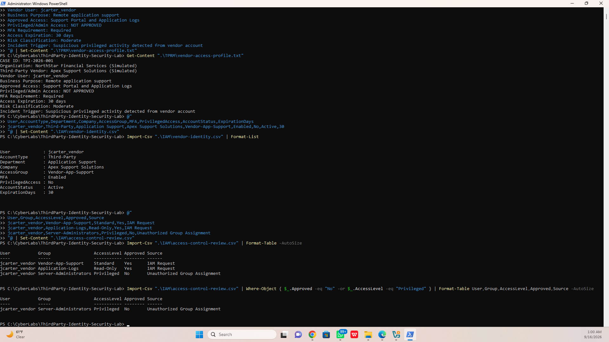
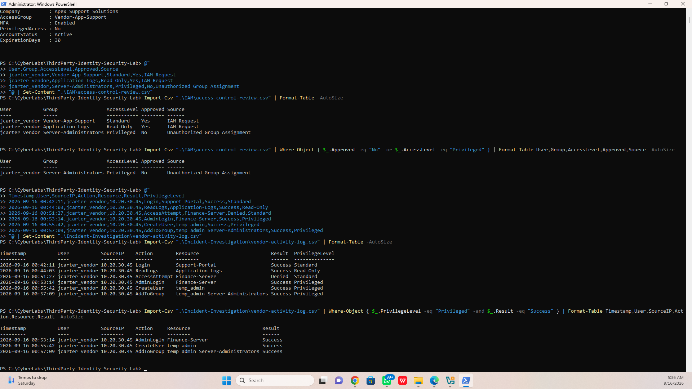
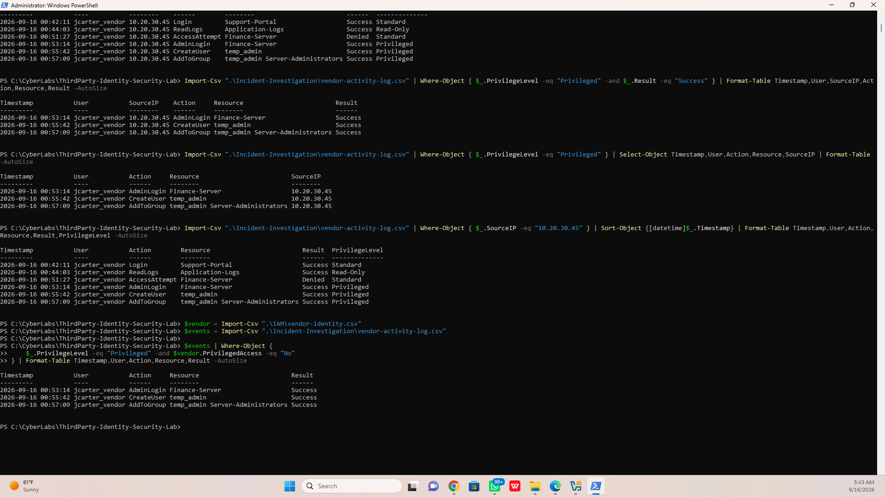
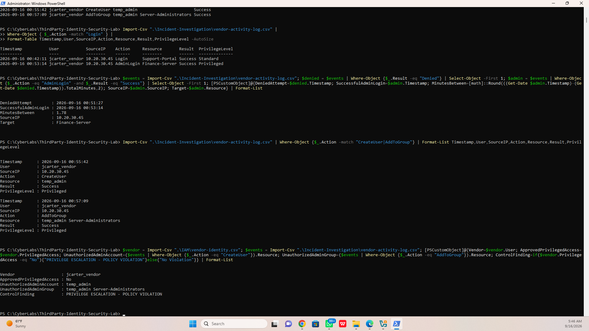
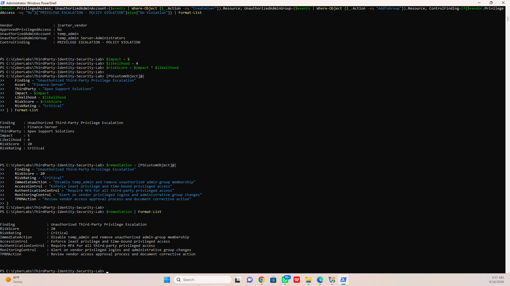
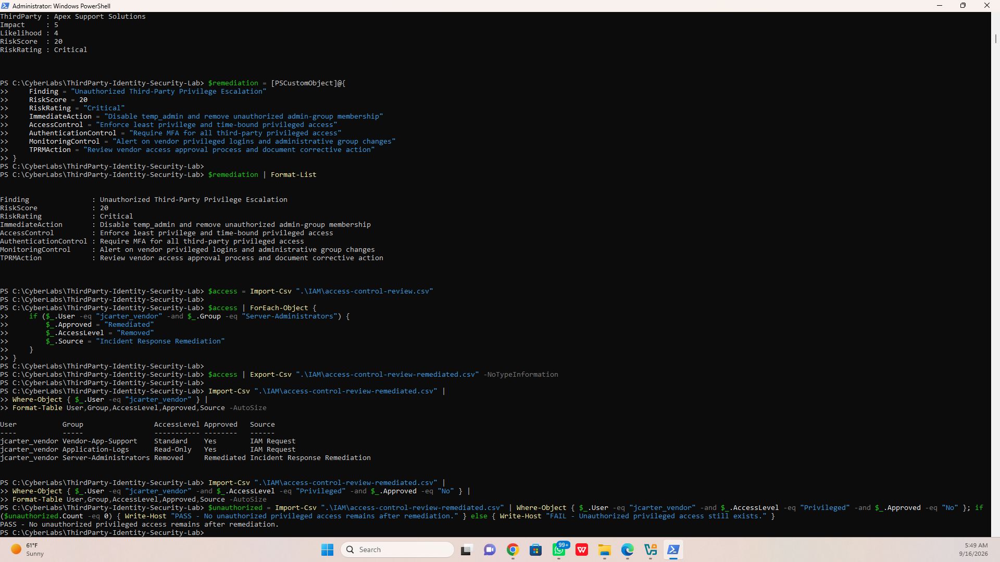
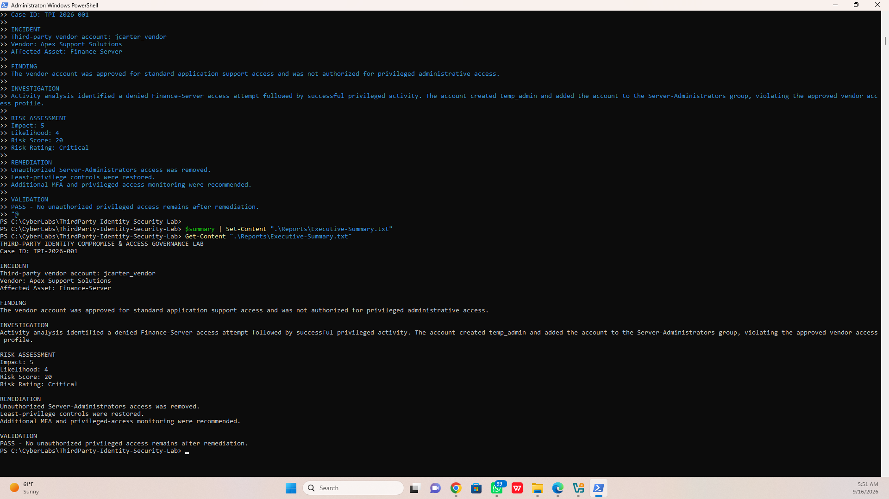

# Third-Party Identity Security \& Privileged Access Investigation Lab

## Overview

This project simulates a third-party identity security incident involving a vendor account that exceeded its approved access privileges.

The objective was to review the vendor's authorized identity profile, analyze activity logs, identify unauthorized privilege escalation, assess the associated cyber risk, implement remediation, and validate that excessive privileged access had been removed.

The lab demonstrates practical skills across Identity and Access Management (IAM), Security Operations (SOC), Incident Response, Third-Party Risk Management (TPRM), and Governance, Risk, and Compliance (GRC).

## Scenario

A third-party vendor, Apex Support Solutions, was authorized to provide standard application support for the Finance-Server.

The vendor account `jcarter_vendor` was approved for standard access and was not authorized for privileged administrative access.

During activity-log analysis, the account was found performing privileged administrative actions inconsistent with its approved access profile.

## Investigation

The investigation included:

\- Reviewing the vendor's approved access profile

\- Filtering vendor activity logs using PowerShell

\- Identifying a denied Finance-Server access attempt

\- Reconstructing the activity timeline

\- Identifying successful privileged activity

\- Detecting creation of the `temp_admin` account

\- Identifying addition of `temp_admin` to the `Server-Administrators` group

\- Correlating observed activity with the vendor's approved access permissions

The investigation determined that privileged administrative activity occurred despite the vendor having no approved privileged-access authorization.

## Risk Assessment

**Finding:** Unauthorized Third-Party Privilege Escalation

**Affected Asset:** Finance-Server

**Third Party:** Apex Support Solutions

**Impact:** 5  

**Likelihood:** 4  

**Risk Score:** 20  

**Risk Rating:** Critical

The activity violated the vendor's approved access profile and introduced significant risk to a sensitive financial system.

## Remediation

The following remediation actions were identified and implemented within the simulated environment:

\- Removed unauthorized `Server-Administrators` access

\- Restored least-privilege access

\- Recommended MFA for all third-party privileged access

\- Recommended monitoring and alerting for vendor privileged logins and administrative group changes

\- Recommended review of the vendor access approval process and documentation of corrective action

## Validation

Post-remediation validation confirmed:

**PASS — No unauthorized privileged access remains after remediation.**

This demonstrated that the identified excessive access condition was successfully removed.

## Security Concepts Demonstrated

\- Identity and Access Management (IAM)

\- Least Privilege

\- Privileged Access Management

\- Third-Party/Vendor Risk Management

\- Security Log Analysis

\- Incident Investigation

\- Access Control Review

\- Risk Assessment

\- Incident Remediation

\- Post-Remediation Validation

## Tools Used

\- Windows PowerShell

\- CSV-based identity and activity datasets

\- PowerShell filtering and object processing

\- Structured incident reporting

## Project Workflow

Vendor Access Review → Activity Analysis → Privilege Escalation Detection → Incident Investigation → Risk Assessment → Remediation → Validation

## Key Takeaway

This project demonstrates how security teams can correlate third-party identity authorization data with activity logs to detect excessive privileges, investigate unauthorized administrative activity, evaluate risk, implement corrective controls, and verify remediation.

## Investigation Evidence

### 1. Unauthorized Privileged Access Identified

### 2. Privileged Activity Investigation

### 3. Identity and Activity Correlation

### 4. Privilege Escalation Policy Violation

### 5. Critical Risk Assessment

### 6. Remediation Validation

### 7. Executive Summary

